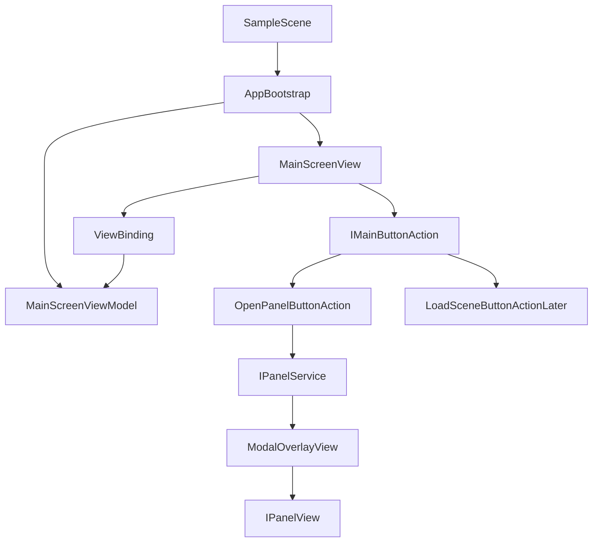

# Архитектура MVVM UI Toolkit

## Цель

Создать чистую модульную основу для UI-heavy мобильной игры на Unity UI Toolkit: главный экран, две кнопки в нижних углах, универсальная система UI-действий и первая реализация действия `OpenPanel`. Архитектура должна позволять позже добавлять действия вроде загрузки сцены без переписывания главного экрана.

## Контекст проекта

Проект: `C:\Projects\ui-toolkit-battlepass`.

Сейчас проект почти пустой: есть `Assets/Scenes/SampleScene.unity`, но нет пользовательских `.cs`, `.uxml`, `.uss`, `PanelSettings`, `UIDocument`, `.asmdef`. Поэтому агенту-исполнителю нужно сначала перейти в этот root workspace, затем создать структуру с нуля.

## Предлагаемая структура файлов

Создать внутри проекта:

- `[Assets/_Project/Scripts/App](Assets/_Project/Scripts/App)` — bootstrap и composition root.
- `[Assets/_Project/Scripts/UI/Core](Assets/_Project/Scripts/UI/Core)` — базовые интерфейсы MVVM, observable свойства, binding helpers.
- `[Assets/_Project/Scripts/UI/Navigation](Assets/_Project/Scripts/UI/Navigation)` — открытие/закрытие панелей, overlay/backdrop, blur lifecycle.
- `[Assets/_Project/Scripts/UI/MainScreen](Assets/_Project/Scripts/UI/MainScreen)` — View, ViewModel и конфиг кнопок главного экрана.
- `[Assets/_Project/Scripts/UI/Panels](Assets/_Project/Scripts/UI/Panels)` — базовые классы/интерфейсы панелей и первая тестовая панель.
- `[Assets/_Project/UI/UXML](Assets/_Project/UI/UXML)` — UXML-разметка.
- `[Assets/_Project/UI/USS](Assets/_Project/UI/USS)` — стили.
- `[Assets/_Project/UI/Settings](Assets/_Project/UI/Settings)` — `PanelSettings` и UI Toolkit assets.
- `[Assets/_Project/Configs/UI](Assets/_Project/Configs/UI)` — ScriptableObject-конфиги кнопок и панелей.

Опционально создать `.asmdef`:

- `[Assets/_Project/Scripts/UI/UI.asmdef](Assets/_Project/Scripts/UI/UI.asmdef)`
- `[Assets/_Project/Scripts/App/App.asmdef](Assets/_Project/Scripts/App/App.asmdef)`

Если агент-исполнитель хочет минимизировать стартовую сложность, `.asmdef` можно добавить сразу один общий: `[Assets/_Project/Scripts/Project.Runtime.asmdef](Assets/_Project/Scripts/Project.Runtime.asmdef)`.

## Архитектурные слои




Слой View должен знать только UI Toolkit `VisualElement` и интерфейсы действий. ViewModel хранит состояние экрана и список моделей кнопок. Сервисы отвечают за эффекты и навигацию, а не за бизнес-логику View.

## Основные контракты

Заложить интерфейсы, чтобы все панели закрывались одинаково и все кнопки могли иметь разные назначения:

```csharp
public interface IMainButtonAction
{
    void Execute();
}

public interface IPanelService
{
    void Open(IPanelView panel);
    void CloseCurrent();
}

public interface IPanelView
{
    VisualElement Root { get; }
    event Action CloseRequested;
    void Bind(object viewModel);
    void OnOpened();
    void OnClosed();
}
```

Для MVVM использовать лёгкий собственный минимум:

```csharp
public sealed class ObservableProperty<T>
{
    public T Value { get; set; }
    public event Action<T> Changed;
}
```

View подписывается на ViewModel через binding helper и отписывается в `Dispose`/`OnDisable`, чтобы не оставлять dangling subscriptions.

## Главный экран

Главный экран должен состоять из:

- `MainScreen.uxml`: root-контейнер, нижняя левая и нижняя правая зоны кнопок, overlay-root для модальных панелей.
- `MainScreen.uss`: layout под мобильный экран, safe area отступы, стили кнопок, backdrop, panel container.
- `MainScreenView`: находит элементы по имени, создаёт/привязывает кнопки из ViewModel, назначает действия.
- `MainScreenViewModel`: хранит коллекцию `MainButtonViewModel`.
- `MainButtonViewModel`: label/icon id/position/action id или готовая ссылка на `IMainButtonAction` через factory.

Начальная конфигурация: две кнопки в левом и правом нижних углах. Обе пока могут открывать разные тестовые панели или одну и ту же панель с разными данными, но механизм должен быть один.

## Действия кнопок

Не хардкодить `button.clicked += OpenPanel` прямо в главном экране. Вместо этого добавить слой действий:

- `IMainButtonAction` — общий интерфейс.
- `OpenPanelButtonAction` — текущая реализация, открывает панель через `IPanelService`.
- `MainButtonActionFactory` — создаёт action по config/type.
- В будущем добавить `LoadSceneButtonAction`, не меняя `MainScreenView`.

Рекомендуемый стартовый вариант конфигов: `ScriptableObject MainButtonConfig` с полями `Id`, `Label`, `Position`, `ActionType`, `PanelId`. Это удобно для UI-heavy игры, где дизайнеры будут часто менять набор кнопок.

## Панели и overlay

Сделать общий `ModalOverlayView`, который содержит:

- backdrop поверх главного экрана;
- blur/dim слой;
- контейнер активной панели;
- обработчик клика по backdrop;
- закрытие по `CloseRequested` от панели;
- метод `CloseCurrent()` в `PanelService`.

Blur на первом этапе лучше реализовать как dim/blur-ready слой через USS-класс, потому что настоящий realtime blur в UI Toolkit требует отдельного shader/render texture решения и может быть дорогим на мобильных. Архитектура должна оставить `IBackgroundBlurService`, чтобы позже заменить dim на настоящий blur без переписывания панелей.

Контракты:

```csharp
public interface IBackgroundBlurService
{
    void Enable();
    void Disable();
}
```

На первом этапе `UiToolkitDimBlurService` просто переключает USS-класс overlay/backdrop.

## Bootstrap и сцена

В `[Assets/Scenes/SampleScene.unity](Assets/Scenes/SampleScene.unity)` добавить один GameObject `AppBootstrap` с компонентом `AppBootstrap`. Он должен:

- создать или получить `UIDocument`;
- подключить `PanelSettings` и `MainScreen.uxml`;
- собрать зависимости вручную без DI-фреймворка;
- создать `PanelService`, `MainScreenViewModel`, `MainScreenView`;
- передать конфиги кнопок и панелей.

DI-контейнер на старте не нужен. Для маленького проекта composition root в `AppBootstrap` будет прозрачнее. Если UI вырастет, позже можно заменить ручную сборку на VContainer/Zenject без изменения View/ViewModel контрактов.

## Порядок реализации для агента-исполнителя

1. Переместить Cursor workspace в `C:\Projects\ui-toolkit-battlepass` через `move_agent_to_root` или работать строго с абсолютными путями.
2. Создать папки `[Assets/_Project](Assets/_Project)` и базовую runtime-сборку.
3. Создать `PanelSettings`, `MainScreen.uxml`, `MainScreen.uss`, подключить `UIDocument` в сцене.
4. Реализовать MVVM core: `ObservableProperty<T>`, disposable binding helper, базовые интерфейсы.
5. Реализовать `MainScreenViewModel`, `MainButtonViewModel`, `MainScreenView`.
6. Реализовать `IMainButtonAction`, `OpenPanelButtonAction`, `MainButtonActionFactory`.
7. Реализовать `IPanelService`, `ModalOverlayView`, `IPanelView`, `IBackgroundBlurService`.
8. Создать первую тестовую панель с крестиком и закрытием по backdrop.
9. Настроить две стартовые кнопки: нижняя левая и нижняя правая, обе через action-конфиги.
10. Проверить компиляцию через Unity console, запустить сцену и проверить: открытие панели, закрытие крестиком, закрытие кликом по backdrop, отсутствие ошибок.

## Критерии готовности

- Главный экран рендерится через UI Toolkit.
- Две кнопки находятся в нижнем левом и нижнем правом углах.
- Нажатие кнопки открывает панель поверх главного экрана.
- Backdrop/blur слой появляется при открытой панели.
- Панель закрывается по крестику и по клику на backdrop.
- Главный экран не знает конкретный тип панели и не содержит логики загрузки сцен.
- Добавление будущего `LoadSceneButtonAction` не требует изменения `MainScreenView`.
- После создания/изменения C# скриптов Unity console не содержит compilation errors.

